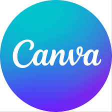

<h3 align="center">Computer Science & Engineering Student | MCKV Institute of Engineering</h3>

---

<table>
<tr>

<td width="60%">

## 🌸 About Me

🎓 I'm *Sukanya Rana, a **Computer Science & Engineering student* passionate about building intelligent systems that combine *software, AI, and hardware automation*.

💡 I love turning real-world problems into *innovative technical solutions* through *Machine Learning, IoT, and Full Stack Development*.

</td>

<td width="40%" align="center">

</td>

</tr>
</table>

---

# 🏆 Achievements

🥇 *Winner — Idea Fusion 2025*
(IoT Model Presentation) @ MCKV Institute of Engineering

 *Participant — Smart India Hackathon (SIH) 2025*

🥉 *2nd Runner-Up — International Pi Day Competition*  @ MCKV Institute of Engineering

---

# 💻 Tech Stack

<table align="center">
<tr>

<td align="center" width="33%">

### Programming Languages

</td>

<td align="center" width="33%">

### Tools & Platforms

</td>

<td align="center" width="33%">

### Creative Tools

  
  
  
  

</td>

</tr>
</table>

---

## 🚀 Featured Projects

<table>

<tr>
<td width="25%" align="center">

### 🌟 PoleStar

</td>

<td width="75%">

*Smart Lighting System for Elderly Care*

An intelligent lighting solution using *IR + LDR sensors* that automatically lights pathways at night, helping elderly individuals move safely while reducing unnecessary power usage.

🔧 *Tech:* Arduino • IR Sensor • LDR • Embedded Systems

</td>
</tr>

<tr>
<td width="25%" align="center">

### 🌱 i-CropWat

</td>

<td width="75%">

*IoT Smart Irrigation System*

A smart irrigation system using *ESP32, soil moisture, temperature & humidity sensors* to automate watering decisions and conserve water while improving crop productivity, and reduce the agricultural wastage.

🔧 *Tech:* ESP32 • IoT • Soil Moisture Sensor • Blynk

</td>
</tr>

</table>

# 📊 Development Dashboard

<table align="center">
<tr>

<td width="50%" align="center">

### 💻 Coding Language Insights

</td>

<td width="50%" align="center">

### 📊 GitHub Development Stats

</td>

</tr>
</table>

# 📈 GitHub Activity Graph

---

## 🧠 Beyond the Code

<table>
<tr>

<td width="60%">

### 🌟 Developer Mindset

I build with *logic, design with **purpose, and learn through **experimentation*.

> 💡 Code is the tool. Thinking is the real skill.

🧩 Problem solver by habit
🚀 Curious builder by nature
🔍 Exploring *Machine Learning, IoT & Web Development*

### 🌐 Let's Connect

</td>

<td width="40%" align="center">

 

✨ Debugging life one line of code at a time.

</td>

</tr>
</table>

---

✨ Curiosity builds code. Code builds the future.

